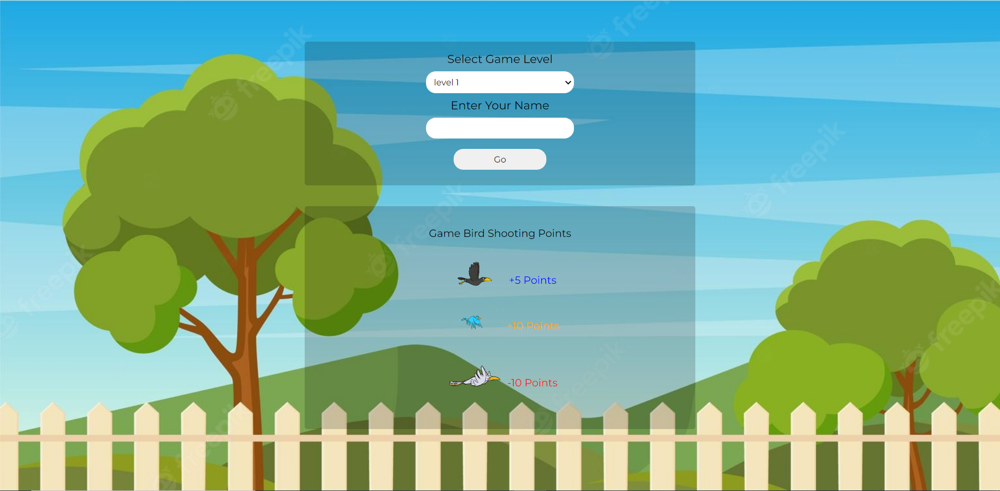
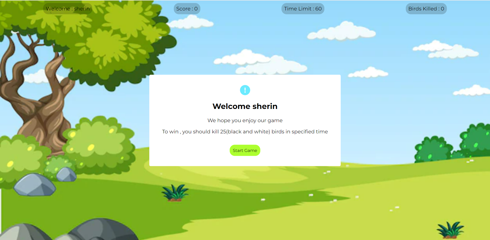
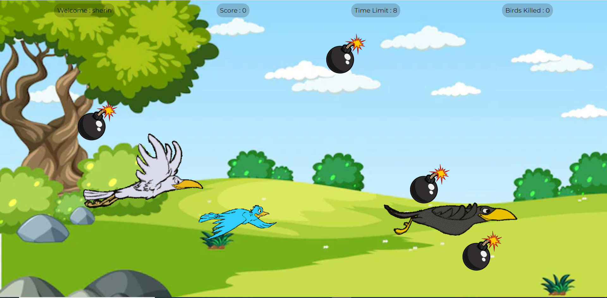
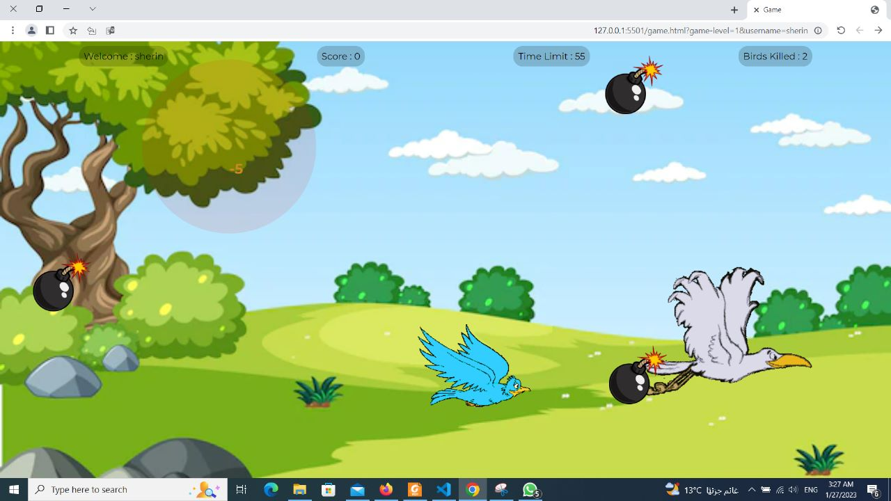
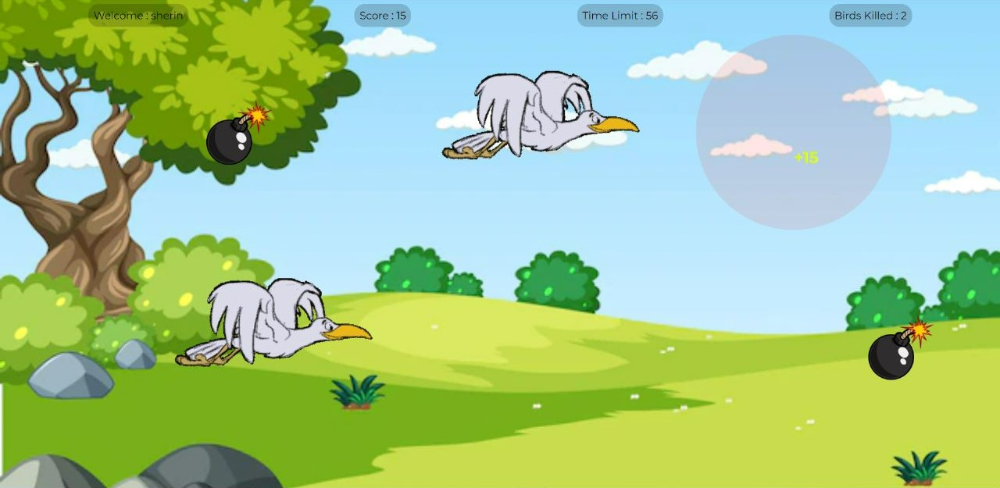

# Birds Shooting Game :innocent:
###### This is my simple birds shooting game using vanilla JavaScript , CSS and HTML only

###### Description:
1. Home page

2. Start game

3. Birds fly from random positions
4. Bombs fall from different positions

5. Each bird has specific score negative or positive according to bird
6. Explosion of bomb kills surrounding birds
7. Net added or removed score is shown to player 
8. Explosion of bomb has red effect

9. Result if score is less than 25 you lose

